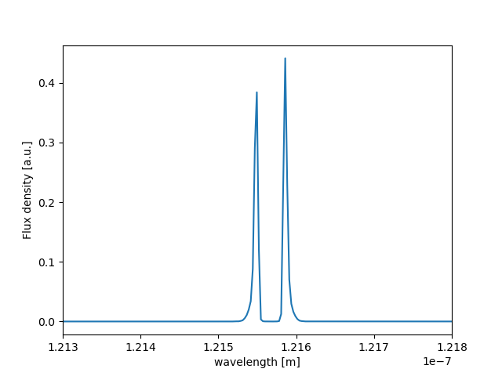

About the LyaRT data grids
==========================

Here we explain a little bit the data grid from `LyaRT`, the Radiative Monte Carlo Code described in Orsi et al. 2012 ( https://github.com/aaorsi/LyaRT ). These grids are the pillars of `zELDA`, so it is good to familiared with them.  

Getting started
***************

Let's start by loading `zELDA` and setting the location of the LyaRT grids:

.. code:: python

          >>> import Lya_zelda as Lya

          >>> your_grids_location = '/This/Folder/Contains/The/Grids/'

          >>> Lya.funcs.Data_location = your_grids_location

where `/This/Folder/Contains/The/Grids/` is the place where you store the LyaRT data grids, as shown in the :doc:`Installation <installation>` section.

Line profile LyaRT data grids
*****************************

Let's load a data grid to start working. In particular we are going to load the one for the 'Thin_Shell' geometry. This geometry has 3 varibles for the outflow configuration: expansion velocity, HI column density and dust optical depth. 

.. code:: python

          >>> LyaRT_Grid = Lya.load_Grid_Line( 'Thin_Shell' )

`LyaRT_Grid` is a python dictionary containing all the data necessary for the interpolation. Let's look to the keys

.. code:: python

          >>> print( LyaRT_Grid.keys() )

          dict_keys(['logNH_Arr', 'logta_Arr', 'Grid', 'x_Arr', 'V_Arr'])

The varibles `'V_Arr'`, `'logNH_Arr'` and `'logta_Arr'` are 1-D numpy arrays that contains the values in which the grid is evaluated for the expansion velocity, the logarithmic of the HI column density and  the logarithmic of the dust optical depth respectively. If you want to check where the grid is evaluated you can do

.. code:: python

          >>> print( 'The expansion velocity [km/s] is evaluated in : ')
          >>> print( LyaRT_Grid['V_Arr'    ] )

          >>> print( 'The logarithmic of the HI column density [cm**-2] is evaluated in : ')
          >>> print( LyaRT_Grid['logNH_Arr'] )

          >>> print( 'The logarithmic of the dust optical depth is evaluated in : ')
          >>> print( LyaRT_Grid['logta_Arr'] )

          The expansion velocity [km/s] is evaluated in :
          [   0   10   20   30   40   50   60   70   80   90  100  150  200  250
            300  350  400  450  500  550  600  650  700  750  800  850  900  950
           1000]
          The logarithmic of the HI column density [cm**-2] is evaluated in :
          [17.   17.25 17.5  17.75 18.   18.25 18.5  18.75 19.   19.25 19.5  19.75
           20.   20.25 20.5  20.75 21.   21.25 21.5  21.75 22.  ]
          The logarithmic of the dust optical depth is evaluated in :
          [-3.75  -3.5   -3.25  -3.    -2.75  -2.5   -2.25  -2.    -1.75  -1.5
           -1.375 -1.25  -1.125 -1.    -0.875 -0.75  -0.625 -0.5   -0.375 -0.25
           -0.125]

Then, `LyaRT_Grid['Grid']` are the line profiles in each of the nodes of the 3-D grid. For example, `LyaRT_Grid['Grid'][0,1,2]` is the line profile with `LyaRT_Grid['V_Arr'][0]`, `LyaRT_Grid['logNH_Arr'][1]` and `LyaRT_Grid['logta_Arr'][2]`. This spectrum is evaluated in `LyaRT_Grid['x_Arr']`, that is the frequency in Doppler units. You can convert from frequency in Doppler units to wavelgnth by doing:

.. code:: python
 
          >>> w_Arr = Lya.convert_x_into_lamda( LyaRT_Grid['x_Arr'] )

`w_Arr` is a 1-D array with the wavelgnths in meters. Let's take a look to the spectrum:

.. code:: python
            
          >>> import pylab as plt
          >>> plt.plot( w_Arr , LyaRT_Grid['Grid'][0,1,2] )
          >>> plt.xlim( 1213*1e-10 , 1218*1e-10 )
          >>> plt.xlabel( 'wavelength [m]' )
          >>> plt.ylabel( 'Flux density [a.u.]' )
          >>> plt.show()

Line profile grids with smaller RAM occupation
**********************************************

The data grids for the geometries `'Thin_Shell'`, `'Galactic_Wind'`, `'Bicone_X_Slab_In'` and `'Bicone_X_Slab_Out'` are relatively small and they occupy less than 1GB of RAM. These models have 3 dimensions: expansion velocity, HI column density and dust optical depth. However, the model `'Thin_Shell_Cont'` includes different intrinsic line profiles, which increases the number of dimensions to 5. This increase a lot the data volume, interms of paramter space and RAM occupation. Indeed, the default `'Thin_Shell_Cont'` line profile grid is about 11GB. This means that when using this mode you would need to have 11GB of RAM or more. In case that you want to do some tests with a smaller grid (but still 5D) we have included a lighter grid, that is about 2GB of size.  

You can load the default `'Thin_Shell_Cont'` by doing

.. code:: python

          >>> import Lya_zelda as Lya

          >>> your_grids_location = '/This/Folder/Contains/The/Grids/'

          >>> Lya.funcs.Data_location = your_grids_location

where `/This/Folder/Contains/The/Grids/` is the place where you store the LyaRT data grids, as shown in the :doc:`Installation <installation>` section.

.. code:: python

          >>> LyaRT_Grid_Full = Lya.load_Grid_Line( 'Thin_Shell_Cont' )

or 

.. code:: python

          >>> LyaRT_Grid_Full = Lya.load_Grid_Line( 'Thin_Shell_Cont' , MODE='FULL' )

And you can see where the grid is evaluated by doing

.. code:: python

          >>> print( 'The expansion velocity [km/s] is evaluated in : ')
          >>> print( LyaRT_Grid_Full['V_Arr'] )
          
          >>> print( 'The logarithmic of the HI column density [cm**-2] is evaluated in : ')
          >>> print( LyaRT_Grid_Full['logNH_Arr'] )
          
          >>> print( 'The logarithmic of the dust optical depth is evaluated in : ')
          >>> print( LyaRT_Grid_Full['logta_Arr'] )
          
          >>> print( 'The logarithmic of the intrinsic equivalent width [A] is evaluated in : ')
          >>> print( LyaRT_Grid_Full['logEW_Arr'] )
          
          >>> print( 'The logarithmic of the intrinsic line width [A] is evaluated in : ')
          >>> print( LyaRT_Grid_Full['Wi_Arr'] )

          The expansion velocity [km/s] is evaluated in :
          [   0   10   20   30   40   50   60   70   80   90  100  150  200  250
            300  350  400  450  500  550  600  650  700  750  800  850  900  950
           1000]
          The logarithmic of the HI column density [cm**-2] is evaluated in :
          [17.   17.25 17.5  17.75 18.   18.25 18.5  18.75 19.   19.25 19.5  19.75
           20.   20.25 20.5  20.75 21.   21.25 21.5 ]
          The logarithmic of the dust optical depth is evaluated in :
          [-4.  -3.5 -3.  -2.5 -2.  -1.5 -1.  -0.5  0. ]
          The logarithmic of the intrinsic equivalent width [A] is evaluated in :
          [-1.         -0.78947368 -0.57894737 -0.36842105 -0.15789474  0.05263158
            0.26315789  0.47368421  0.68421053  0.89473684  1.10526316  1.31578947
            1.52631579  1.73684211  1.94736842  2.15789474  2.36842105  2.57894737
            2.78947368  3.        ]
          The logarithmic of the intrinsic line width [A] is evaluated in :
          [0.01 0.05 0.1  0.15 0.2  0.3  0.4  0.5  0.6  0.7  0.8  0.9  1.   1.2
           1.4  1.6  1.8  2.   2.2  2.4  2.6  2.8  3.   3.25 3.5  3.75 4.   5.25
           5.5  5.75 6.  ]

Now let's load the lighter grid for `'Thin_Shell_Cont'`,

.. code:: python

          >>> LyaRT_Grid_Light = Lya.load_Grid_Line( 'Thin_Shell_Cont' , MODE='LIGHT' )

The reduction of the size of the grid is done by reducing the number of bins in `'logEW_Arr'` and `'Wi_Arr'`. You can see the new `'logEW_Arr'` and `'Wi_Arr'` arrays in:

.. code:: python

          >>> print( 'The logarithmic of the intrinsic equivalent width [A] is evaluated in : ')
          >>> print( LyaRT_Grid_Light['logEW_Arr'] )

          >>> print( 'The logarithmic of the intrinsic line width [A] is evaluated in : ')
          >>> print( LyaRT_Grid_Light['Wi_Arr'] ) 

          The logarithmic of the intrinsic equivalent width [A] is evaluated in :
          [-1.   0.   0.4  0.8  1.2  1.6  2.   3. ]
          The logarithmic of the intrinsic line width [A] is evaluated in :
          [0.01 0.05 0.1  0.25 0.5  1.   2.   4.   6.  ]

If you want a smaller custom grid, you can build your own data grid by selecting nodes from `LyaRT_Grid_Full`. As long as you keep the format of `LyaRT_Grid_Full`, you will be able to pass your custom grids to the algorithms. Just as a short advice, it would be beneficial in you keep the very extrems in the evlatuion arrays (for example, `LyaRT_Grid_Full['V_Arr'][0]` and `LyaRT_Grid_Full['V_Arr'][-1]`) in your new custom grid. 

