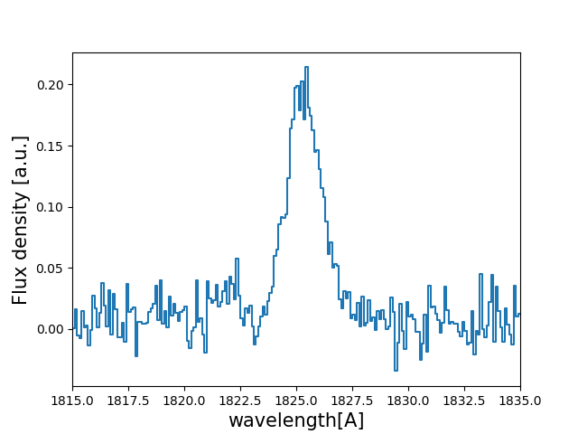
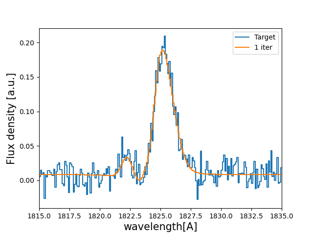

Tutorial : Fitting a line profile using deep learning
=====================================================

In this tutorial you will, hopefully, learn how fit Lyman-alpha line profiles ussing deep learning with `zELDA`. 

Getting started
***************

Let's start by loading `zELDA` creating a mock line profile that we will fit later. For more details on how to create a mock line profile go to :doc:`Mock line profiles <Tutorial_mock>`

.. code:: python

          >>> import Lya_zelda as Lya
          >>> your_grids_location = '/This/Folder/Contains/The/Grids/'
          >>> Lya.funcs.Data_location = your_grids_location

          >>> Geometry = 'Thin_Shell_Cont'

          >>> # Defining the model parameters:
          >>> z_t      = 0.5   # redshift of the source
          >>> V_t      = 50.0  # Outflow expansion velocity [km/s]
          >>> log_N_t  = 20.   # Logarithmic of the neutral hydrogen column density [cm**-2]
          >>> t_t      = 0.01  # Dust optical depth
          >>> log_EW_t = 1.5   # Logarithmic the intrinsic equivalent width [A]
          >>> W_t      = 0.5   # Intrinsic width of the line [A]
          >>> F_t      = 1.    # Total flux of the line

          >>> # Defining the quality of the line profile:
          >>> PNR_t  = 15.0 # Signal to noise ratio of the maximum of the line.
          >>> FWHM_t = 0.2  # Full width half maximum diluting the line. Mimics finite resolution. [A]
          >>> PIX_t  = 0.1  # Wavelength binning of the line. [A]

          >>> w_Arr , f_Arr , s_Arr = Lya.Generate_a_real_line( z_t , V_t, log_N_t, t_t, F_t, log_EW_t, W_t , PNR_t, FWHM_t, PIX_t, LyaRT_Grid, Geometry )

where `/This/Folder/Contains/The/Grids/` is the place where you store the LyaRT data grids, as shown in the installation section. And... It's done! `w_Arr` is a numpy array that contains the wavelength where the line profile is evaluated. Meanwhile, `f_Arr` is the actuall line profile. `s_Arr` is the uncertainty of the flux density. 

Let's have a look to how the line looks:

.. code:: python

          >>> w_Arr , f_Arr , s_Arr  = Lya.Generate_a_real_line( z_t , V_t, log_N_t, t_t, F_t, log_EW_t, W_t , PNR_t, FWHM_t, PIX_t, LyaRT_Grid, Geometry )

          >>> w_pix_Arr , f_pix_Arr = Lya.plot_a_rebinned_line( w_Arr , f_Arr , PIX_t )

          >>> plt.plot( w_pix_Arr , f_pix_Arr )
          >>> plt.xlabel('wavelength[A]' , size=15 )
          >>> plt.ylabel('Flux density [a.u.]' , size=15 )
          >>> plt.xlim(1815,1835)
          >>> plt.show()

Now that we have our mock line profile. Let's load the neural network. As we have produce a line profile for an outflow (`V_t`>0) we are going to load the deep neural network for outflows 

.. code:: python

          >>> machine_data =  Lya.Load_NN_model( 'Outflow' ) 

In case you want to do the anlysis for inflows just call `Lya.Load_NN_model( 'Inflow' )`. `machine_data` is a python dictionary that contains all the necessary data for the deep neural network approach. Let's pick up from it two variables:

.. code:: python

          >>> machine    = machine_data['Machine' ]  
          >>> w_rest_Arr = machine_data[ 'w_rest' ]

`machine` is an object from skitlearn with the trained neural netwrok and `w_rest_Arr` is the rest frame wavelength where the line profiles used for the training were evaluated. `w_rest_Arr` is important to check that the neural networks is working in the same wavelength array that the line profiles will be evaluated. In principle you don't have to do anything with `w_rest_Arr`, but we need to pass it to other functions. 

Using the DNN in the un-perturbed line profile
**********************************************

Let's start by simple evaluating the DNN using the mock line profile without perturbing it:

.. code:: python

          >>> Sol , z_sol = Lya.NN_measure( w_Arr , f_Arr , s_Arr , FWHM_t , PIX_t , machine , w_rest_Arr , N_iter=None )

Done! . `Sol` is a matrix that contains the prediction by the DNN and `z_sol` is the predicted redshift. You can print the predicted properties doing:

.. code:: python

          >>> print( 'The measured redshift                                                     is' , z_sol    )
          >>> print( 'The measured logarithm of the expasion velocity                           is' , Sol[0,1] )
          >>> print( 'The measured logarithm of the HI column density                           is' , Sol[0,2] )
          >>> print( 'The measured logarithm of the dust optical depth                          is' , Sol[0,3] )
          >>> print( 'The measured logarithm of the intrinsic equivalent width                  is' , Sol[0,4] )
          >>> print( 'The measured logarithm of the intrinsic            width                  is' , Sol[0,5] )
          >>> print( 'The measured shift of the true Lya wavelgnth from the maximum of the line is' , Sol[0,0] )

This should give something like

.. code:: python

          The measured redshift                                                     is 0.49994403239322693
          The measured logarithm of the expasion velocity                           is 1.5821419036064905
          The measured logarithm of the HI column density                           is 20.149247231711733
          The measured logarithm of the dust optical depth                          is -3.310662004999448
          The measured logarithm of the intrinsic equivalent width                  is 1.458352960574508
          The measured logarithm of the intrinsic            width                  is -0.804093047888869
          The measured shift of the true Lya wavelgnth from the maximum of the line is -1.2773994188976223

Let's see how this new spectrum compares with the target:

.. code:: python

          >>> PNR = 100000. # let's put infinite signal to noise in the model line

          >>> V_sol    = 10**Sol[0,1] # Expansion velocity km/s
          >>> logN_sol =     Sol[0,2] # log of HI column density cm**-2
          >>> t_sol    = 10**Sol[0,3] # dust optical depth
          >>> logE_sol =     Sol[0,4] # log intrinsic EW [A]
          >>> W_sol    = 10**Sol[0,5] # intrinsic width [A]

          # creates the line

          >>> w_One_Arr , f_One_Arr , _  = Lya.Generate_a_real_line( z_sol , V_sol, logN_sol, t_sol, F_t, logE_sol, W_sol, PNR, FWHM_t, PIX_t, LyaRT_Grid, Geometry )

          # plot the target and the predicted line

          >>> w_pix_One_Arr , f_pix_One_Arr = Lya.plot_a_rebinned_line( w_One_Arr , f_One_Arr , PIX_t )

          >>> plt.plot( w_pix_Arr     , f_pix_Arr     , label='Target' )
          >>> plt.plot( w_pix_One_Arr , f_pix_One_Arr , label='1 iter' )

          >>> plt.legend(loc=0)
          >>> plt.xlabel('wavelength[A]' , size=15 )
          >>> plt.ylabel('Flux density [a.u.]' , size=15 )
          >>> plt.xlim(1815,1835)
          >>> plt.show()

You should get something like:

Using the DNN with Monte Carlo perturbations
********************************************

Normally, it is better to do more than one iteration, as it leads to better results. These iterations basically perturb the flux density `f_Arr` by adding gaussian noise with the applitude of `s_Arr` in each wavelength bin. Then, this new perturbed spectrum is send to the DNN. For each of these iterations the output of the DNN is stored. For example for 1000 iterations :

.. code:: python

          >>> Sol , z_sol , log_V_Arr , log_N_Arr , log_t_Arr , z_Arr , log_E_Arr , log_W_Arr = Lya.NN_measure( w_Arr , f_Arr , s_Arr , FWHM_t , PIX_t , machine , w_rest_Arr , N_iter=1000 )

The arrays `log_V_Arr`, `log_N_Arr`, `log_t_Arr`, `z_Arr`, `log_E_Arr` and `log_W_Arr` contain the output of the DNN for the iterations for the logarithms of the expansion velocity, the logarithm of the neutral hydrogen column density, the logarithm of the dust optical depth, the redshift, the logarithm of the intrinsic equivalent width and the logarithm of the intrinsic width of the line. From these arrays we can compute the result from the DNN analysis by taking the 50th percentile. The +-1 sigma uncertainty can be computed as the 16th and 84th percentile. 

.. code:: python

          >>> # Redshitft
          >>> z_50     = np.percentile(    z_Arr , 50 )
          >>> z_16     = np.percentile(    z_Arr , 16 )
          >>> z_84     = np.percentile(    z_Arr , 84 )

          >>> # Expansion velocity
          >>> V_50     = 10 ** np.percentile( log_V_Arr , 50 )
          >>> V_16     = 10 ** np.percentile( log_V_Arr , 16 )
          >>> V_84     = 10 ** np.percentile( log_V_Arr , 84 )

          >>> # Logarithmic of HI column density
          >>> log_N_50 = np.percentile( log_N_Arr , 50 )
          >>> log_N_16 = np.percentile( log_N_Arr , 16 )
          >>> log_N_84 = np.percentile( log_N_Arr , 84 )

          >>> # Dust optical depth
          >>> t_50     = 10 ** np.percentile( log_t_Arr , 50 )
          >>> t_16     = 10 ** np.percentile( log_t_Arr , 16 )
          >>> t_84     = 10 ** np.percentile( log_t_Arr , 84 )

          >>> # Logarithmic of intrinsic equivalent width
          >>> log_E_50 = np.percentile( log_E_Arr , 50 )
          >>> log_E_16 = np.percentile( log_E_Arr , 16 )
          >>> log_E_84 = np.percentile( log_E_Arr , 84 )

          >>> # Intrinsic width
          >>> W_50     = 10 ** np.percentile( log_W_Arr , 50 )
          >>> W_16     = 10 ** np.percentile( log_W_Arr , 16 )
          >>> W_84     = 10 ** np.percentile( log_W_Arr , 84 )

let's see how the line profiles look:

.. code:: python

          >>> # Compute the 100 iterations line profile
          >>> w_50th_Arr , f_50th_Arr , _  = Lya.Generate_a_real_line( z_50 , V_50, log_N_50, t_50, F_t, log_E_50, W_50, PNR, FWHM_t, PIX_t, LyaRT_Grid, Geometry )

          >>> # Get cooler profiles
          >>> w_pix_50th_Arr , f_pix_50th_Arr = Lya.plot_a_rebinned_line( w_50th_Arr , f_50th_Arr , PIX_t )

          >>> # Plot
          >>> plt.plot( w_pix_Arr      , f_pix_Arr      , label='Target'   )
          >>> plt.plot( w_pix_One_Arr  , f_pix_One_Arr  , label='1 iter'   )
          >>> plt.plot( w_pix_50th_Arr , f_pix_50th_Arr , label='1000 iter')

          >>> plt.legend(loc=0)
          >>> plt.xlabel('wavelength[A]' , size=15 )
          >>> plt.ylabel('Flux density [a.u.]' , size=15 )
          >>> plt.xlim(1815,1835)
          >>> plt.show()

.. image:: figs_and_codes/fig_Tutorial_3_3.png
   :width: 600

finally, let's compare the parameters that we got with the input:

.. code:: python

          >>> print( 'The true redshift                 is' , z_t      , 'and the predicted is' , z_50     , '(-' , z_50-z_16         , ', +' , z_84-z_50         , ')' )
          >>> print( 'The true expansion velocity       is' , V_t      , 'and the predicted is' , V_50     , '(-' , V_50-V_16         , ', +' , V_84-V_50         , ')' )
          >>> print( 'The true dust optical depth       is' , t_t      , 'and the predicted is' , t_50     , '(-' , t_50-t_16         , ', +' , t_84-t_50         , ')' )
          >>> print( 'The true intrinsic width          is' , W_t      , 'and the predicted is' , W_50     , '(-' , W_50-W_16         , ', +' , W_84-W_50         , ')' )
          >>> print( 'The true log of HI column density is' , log_N_t  , 'and the predicted is' , log_N_50 , '(-' , log_N_50-log_N_16 , ', +' , log_N_84-log_N_50 , ')' )
          >>> print( 'The true log of equivalent width  is' , log_EW_t , 'and the predicted is' , log_E_50 , '(-' , log_E_50-log_E_16 , ', +' , log_E_84-log_E_50 , ')' )

This should give something like:

.. code:: python

          The true redshift                 is 0.5 and the predicted is 0.49999833428137275 (- 0.00017321665235831007 , + 0.0003615214512187048 )
          The true expansion velocity       is 50.0 and the predicted is 47.070589157142614 (- 16.100374040796254 , + 48.27234502291723 )
          The true dust optical depth       is 0.01 and the predicted is 0.00379679848371737 (- 0.003483235501588427 , + 0.049396128990436335 )
          The true intrinsic width          is 0.5 and the predicted is 0.280484205908298 (- 0.12228181625600373 , + 0.2150273326940031 )
          The true log of HI column density is 20.0 and the predicted is 20.019139948537997 (- 0.5728866241916535 , + 0.207985045834004 )
          The true log of equivalent width  is 1.5 and the predicted is 1.5595962407058306 (- 0.09992888862396399 , + 0.16009784914990055 )

The particular values that you print will be slightly different when you run it, but more or less it should go in the same direction. 

Tha was fun, hah? Now you know how to use the deep neural network scheme in `zELDA`.

