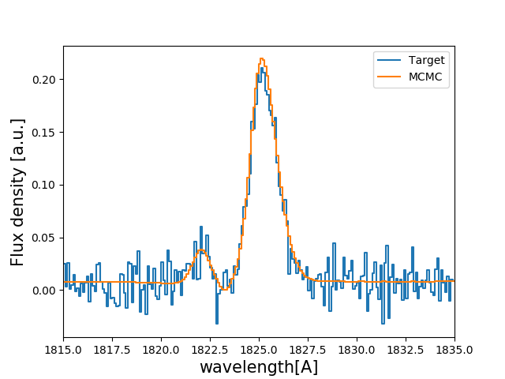

Tutorial : Fitting a line profile using Monte Carlo Markov Chains
=================================================================

In this tutorial you will, hopefully, learn how fit Lyman-alpha line profiles using a Monte Carlo Markov Chain with `zELDA`. The MCMC engine is `emcee` (https://emcee.readthedocs.io/en/stable/). 

Getting started
***************

Let's start by loading `zELDA` creating a mock line profile that we will fit later. For more details on how to create a mock line profile go to :doc:`Mock line profiles <Tutorial_mock>`

.. code:: python

          >>> import Lya_zelda as Lya
          >>> your_grids_location = '/This/Folder/Contains/The/Grids/'
          >>> Lya.funcs.Data_location = your_grids_location

          >>> Geometry = 'Thin_Shell_Cont'
          >>> LyaRT_Grid = Lya.load_Grid_Line( Geometry )

          >>> # Defining the model parameters:
          >>> z_t      = 0.5   # redshift of the source
          >>> V_t      = 40.0  # Outflow expansion velocity [km/s]
          >>> log_N_t  = 20.   # Logarithmic of the neutral hydrogen column density [cm**-2]
          >>> t_t      = 0.01  # Dust optical depth
          >>> log_EW_t = 1.5   # Logarithmic the intrinsic equivalent width [A]
          >>> W_t      = 0.5   # Intrinsic width of the line [A]
          >>> F_t      = 1.    # Total flux of the line

          >>> # Defining the quality of the line profile:
          >>> PNR_t  = 15.0 # Signal to noise ratio of the maximum of the line.
          >>> FWHM_t = 0.2  # Full width half maximum diluting the line. Mimics finite resolution. [A]
          >>> PIX_t  = 0.1  # Wavelength binning of the line. [A]

          >>> w_Arr , f_Arr , s_Arr = Lya.Generate_a_real_line( z_t , V_t, log_N_t, t_t, F_t, log_EW_t, W_t , PNR_t, FWHM_t, PIX_t, LyaRT_Grid, Geometry )

where `/This/Folder/Contains/The/Grids/` is the place where you store the LyaRT data grids, as shown in the installation section. And... It's done! `w_Arr` is a numpy array that contains the wavelength where the line profile is evaluated. Meanwhile, `f_Arr` is the actual line profile. `s_Arr` is the uncertainty of the flux density. 

Let's have a look to how the line looks:

.. code:: python

          >>> w_Arr , f_Arr , s_Arr  = Lya.Generate_a_real_line( z_t , V_t, log_N_t, t_t, F_t, log_EW_t, W_t , PNR_t, FWHM_t, PIX_t, LyaRT_Grid, Geometry )

          >>> w_pix_Arr , f_pix_Arr = Lya.plot_a_rebinned_line( w_Arr , f_Arr , PIX_t )

          >>> import pylab as plt
          >>> plt.plot( w_pix_Arr , f_pix_Arr )
          >>> plt.xlabel('wavelength[A]' , size=15 )
          >>> plt.ylabel('Flux density [a.u.]' , size=15 )
          >>> plt.xlim(1815,1835)
          >>> plt.show()

.. image:: figs_and_codes/fig_Tutorial_4_1.png
   :width: 600

The MCMC anlysis
****************

Let's now set the configuration for the MCMC analysis. 

.. code:: python

          >>> N_walkers = 200 # Number of walkers
          >>> N_burn    = 200 # Number of steps to burn-in
          >>> N_steps   = 300 # Number of steps to run after burning-in

Now let's choose the method to initialize the walkers. There are basically two methods: using the deep neural network or doing a fast particle swarm optimization (PSO). For this tutorial we will use the deep neural network.

.. code:: python

          >>> MODE = 'DNN'

If you want to use instead the PSO you can set `MODE = 'PSO'`. 

Now let's get the regions where we want to originally spawn our lovely walkers:

.. code:: python

          >>> log_V_in , log_N_in , log_t_in , log_E_in , W_in , z_in , Best = Lya.MCMC_get_region_6D( MODE , w_Arr , f_Arr , s_Arr , FWHM_t , PIX_t , LyaRT_Grid , Geometry )

The variables `log_V_in`, `log_N_in`, `log_t_in`, `log_E_in`, `W_in` and `z_in` are python lists of two elements containing the range where to spawn the walkers for the logarithmic of the bulk velocity, the logarithmic of the HI column density, the logarithmic of the dust optical, the logarithmic of the intrinsic equivalent width, the intrinsic width of the line and the redshift. For example, `z_in[0]` contains the minimum redshift and `z_in[0]` the maximum. Actually this step is not necessary and if you want you can continue without defining these variables or setting them as you please. Also, remember that these list only maker where the walkers are spawned. They might actually get outside this volume if the best fitting region is outside.

Let's now run the MCMC:

.. code:: python

          >>> sampler = Lya.MCMC_Analysis_sampler_5( w_Arr , f_Arr , s_Arr , FWHM_t , N_walkers , N_burn , N_steps , Geometry , LyaRT_Grid , z_in=z_in , log_V_in=log_V_in , log_N_in=log_N_in , log_t_in=log_t_in , log_E_in=log_E_in , W_in=W_in )

`sampler` is an object of the python package `emcee`. Note that there is a way of forcing the redshift to be inside `z_in`. We decided to this with only this property in case you know the redshift of the source before hand. you can do this by passing `FORCE_z=True` to `Lya.MCMC_Analysis_sampler_5`.

Now let's get the actual value of the predicted properties and their 1-sigma uncertainty. For this, in this tutorial we chose as our prediction the percentile 50th o the probability distribution function of the variables. For the +-1-sigma uncertainty we choose the percentiles 16th and 84th.  

.. code:: python

          >>> Q_Arr = [ 16 , 50 , 84 ] # You can add more percentiles here, like 95
          
          >>> perc_matrix_sol , flat_samples = Lya.get_solutions_from_sampler( sampler , N_walkers , N_burn , N_steps , Q_Arr )

`flat_samples` contains the MCMC chains flatten. `perc_matrix_sol` is a 2-D array with dimensions `6xlen(Q_Arr)` containing the percentiles of the variables. You can extract the values doing something like:

.. code:: python

          >>> # redshift.
          >>> z_16     =     perc_matrix_sol[ 3 , 0 ] # corresponds to Q_Arr[0]
          >>> z_50     =     perc_matrix_sol[ 3 , 1 ] # corresponds to Q_Arr[1]
          >>> z_84     =     perc_matrix_sol[ 3 , 2 ] # corresponds to Q_Arr[2]

          >>> # Expansion velocity.
          >>> V_16     = 10**perc_matrix_sol[ 0 , 0 ]
          >>> V_50     = 10**perc_matrix_sol[ 0 , 1 ]
          >>> V_84     = 10**perc_matrix_sol[ 0 , 2 ]

          >>> # dust optical depth. 
          >>> t_16     = 10**perc_matrix_sol[ 2 , 0 ]
          >>> t_50     = 10**perc_matrix_sol[ 2 , 1 ]
          >>> t_84     = 10**perc_matrix_sol[ 2 , 2 ]

          >>> # Intrinsic width.
          >>> W_16     =     perc_matrix_sol[ 5 , 0 ]
          >>> W_50     =     perc_matrix_sol[ 5 , 1 ]
          >>> W_84     =     perc_matrix_sol[ 5 , 2 ]

          >>> # Logarithmic of the intrinsic equivalent width.
          >>> log_E_16 =     perc_matrix_sol[ 4 , 0 ]
          >>> log_E_50 =     perc_matrix_sol[ 4 , 1 ]
          >>> log_E_84 =     perc_matrix_sol[ 4 , 2 ]

          >>> # Logarithmic of the HI column density.
          >>> log_N_16 =     perc_matrix_sol[ 1 , 0 ]
          >>> log_N_50 =     perc_matrix_sol[ 1 , 1 ]
          >>> log_N_84 =     perc_matrix_sol[ 1 , 2 ]

Let's compare the MCMC prediction with the actual input:

.. code:: python

          >>> print( 'The true redshift                 is' , z_t      , 'and the predicted is' , z_50     , '(-' , z_50-z_16         , ', +' , z_84-z_50         , ')' )
          >>> print( 'The true expansion velocity       is' , V_t      , 'and the predicted is' , V_50     , '(-' , V_50-V_16         , ', +' , V_84-V_50         , ')' )
          >>> print( 'The true dust optical depth       is' , t_t      , 'and the predicted is' , t_50     , '(-' , t_50-t_16         , ', +' , t_84-t_50         , ')' )
          >>> print( 'The true intrinsic width          is' , W_t      , 'and the predicted is' , W_50     , '(-' , W_50-W_16         , ', +' , W_84-W_50         , ')' )
          >>> print( 'The true log of HI column density is' , log_N_t  , 'and the predicted is' , log_N_50 , '(-' , log_N_50-log_N_16 , ', +' , log_N_84-log_N_50 , ')' )
          >>> print( 'The true log of equivalent width  is' , log_EW_t , 'and the predicted is' , log_E_50 , '(-' , log_E_50-log_E_16 , ', +' , log_E_84-log_E_50 , ')' )
          
which should look something like:

.. code:: python

          The true redshift                 is 0.5 and the predicted is 0.49991074547548753 (- 1.9665578543492934e-05 , + 0.0014991528312225944 )
          The true expansion velocity       is 40.0 and the predicted is 30.741297629627855 (- 1.097915986182759 , + 244.88872432354253 )
          The true dust optical depth       is 0.01 and the predicted is 0.04392859929402969 (- 0.035550939281926146 , + 0.0103076912398413 )
          The true intrinsic width          is 0.5 and the predicted is 0.2859470609607235 (- 0.09765211992507192 , + 0.06363668998672473 )
          The true log of HI column density is 20.0 and the predicted is 20.215438954615962 (- 2.4584647794744434 , + 0.027551697514507367 )
          The true log of equivalent width  is 1.5 and the predicted is 1.7365288817793056 (- 0.29375812799042955 , + 0.033311663274792735 )

Now let's plot the lines and see how they compare:

.. code:: python

          >>> # Infinite signal to noise in the model
          >>> PNR = 100000. 

          >>> # Compute line
          >>> w_One_Arr , f_One_Arr , _  = Lya.Generate_a_real_line( z_50, V_50, log_N_50, t_50, F_t, log_E_50, W_50, PNR, FWHM_t, PIX_t, LyaRT_Grid, Geometry )

          >>> # Make cooler 
          >>> w_pix_One_Arr , f_pix_One_Arr = Lya.plot_a_rebinned_line( w_One_Arr , f_One_Arr , PIX_t )

          >>> # Plot
          >>> plt.plot( w_pix_Arr     , f_pix_Arr     , label='Target' )
          >>> plt.plot( w_pix_One_Arr , f_pix_One_Arr , label='MCMC'   )
          >>> 
          >>> plt.legend(loc=0)
          >>> plt.xlabel('wavelength[A]' , size=15 )
          >>> plt.ylabel('Flux density [a.u.]' , size=15 )
          >>> plt.xlim(1815,1835)
          >>> plt.show()

This should give you something like this:

Now let's do a correlation plot to see where the walkers are. For this we will use the function `make_corner_plots` which is define just below in this same page, in :ref:`my-reference-label` .

.. code:: python

          >>> make_corner_plots( flat_samples )
          >>> plt.show()

And it should give you something like:

And.. with that it's done. Now you know how to use the MCMC implementation in `zELDA`.

.. _my-reference-label:

Tool to make corraltion plots
*****************************

This is just a code to plot the walkers and the probability distribution funtions of the posteriors of the MCMC analysis.

.. code:: python

          def make_corner_plots( my_chains_matrix ):

              import numpy as np
              import pylab as plt
          
              N_dim = 6
          
              ax_list = []
          
              label_list = [ 'log V' , 'log N' , 'log ta' , 'z' , 'log EW', 'Wi'  ]
          
              MAIN_VALUE_mean   = np.zeros(N_dim)
              MAIN_VALUE_median = np.zeros(N_dim)
              MAIN_VALUE_MAX    = np.zeros(N_dim)
          
              for i in range( 0 , N_dim ):
          
                  x_prop = my_chains_matrix[ : , i ]
          
                  x_prop_min = np.percentile( x_prop , 10 )
                  x_prop_50  = np.percentile( x_prop , 50 )
                  x_prop_max = np.percentile( x_prop , 90 )
          
                  x_min = x_prop_50 - ( x_prop_max - x_prop_min ) * 1.00
                  x_max = x_prop_50 + ( x_prop_max - x_prop_min ) * 1.00
          
                  mamamask = ( x_prop > x_min ) * ( x_prop < x_max )
          
                  MAIN_VALUE_mean[  i] = np.mean(       x_prop[ mamamask ] )
                  MAIN_VALUE_median[i] = np.percentile( x_prop[ mamamask ] , 50 )
          
                  HH , edges_HH = np.histogram( x_prop[ mamamask ] , 30 , range=[ x_prop_min , x_prop_max ] )
          
              plt.figure( figsize=(15,15) )
          
              Q_top = 80
              Q_low = 20
          
              for i in range( 0 , N_dim ):
          
                  y_prop = my_chains_matrix[ : , i ]
          
                  y_prop_min = np.percentile( y_prop , Q_low )
                  y_prop_50  = np.percentile( y_prop , 50 )
                  y_prop_max = np.percentile( y_prop , Q_top  )
          
                  mask_y = ( y_prop > y_prop_min ) * ( y_prop < y_prop_max )
          
                  y_min = y_prop_50 - np.std( y_prop[ mask_y ] )
                  y_max = y_prop_50 + np.std( y_prop[ mask_y ] )
          
                  for j in range( 0 , N_dim ):
          
                      if i < j : continue
          
                      x_prop = my_chains_matrix[ : , j ]
          
                      x_prop_min = np.percentile( x_prop , Q_low )
                      x_prop_50  = np.percentile( x_prop , 50 )
                      x_prop_max = np.percentile( x_prop , Q_top )
          
                      mask_x = ( x_prop > x_prop_min ) * ( x_prop < x_prop_max )
          
                      x_min = x_prop_50 - np.std( x_prop[ mask_x ] )
                      x_max = x_prop_50 + np.std( x_prop[ mask_x ] )
          
                      ax = plt.subplot2grid( ( N_dim , N_dim ) , (i, j)  )
          
                      ax_list += [ ax ]
          
                      DDX = x_max - x_min
                      DDY = y_max - y_min
          
                      if i==j :
          
                          H , edges = np.histogram( x_prop , 30 , range=[x_min,x_max] )
          
                          ax.hist( x_prop , 30 , range=[x_min,x_max] , color='cornflowerblue' )
          
                          ax.plot( [ MAIN_VALUE_median[i] , MAIN_VALUE_median[i] ] , [ 0.0 , 1e10 ] , 'k--' , lw=2 )
          
                          ax.set_ylim( 0 , 1.1 * np.amax(H) )
          
                      else :
          
                          XX_min = x_min - DDX * 0.2
                          XX_max = x_max + DDX * 0.2
          
                          YY_min = y_min - DDY * 0.2
                          YY_max = y_max + DDY * 0.2
          
                          H , edges_y , edges_x = np.histogram2d( x_prop , y_prop , 30 , range=[[XX_min , XX_max],[YY_min , YY_max]] )
          
                          y_centers = 0.5 * ( edges_y[1:] + edges_y[:-1] )
                          x_centers = 0.5 * ( edges_x[1:] + edges_x[:-1] )
          
                          H_min = np.amin( H )
                          H_max = np.amax( H )
          
                          N_bins = 10000
          
                          H_Arr = np.linspace( H_min , H_max , N_bins )[::-1]
          
                          fact_up_Arr = np.zeros( N_bins )
          
                          TOTAL_H = np.sum( H )
          
                          for iii in range( 0 , N_bins ):
          
                              mask = H > H_Arr[iii]
          
                              fact_up_Arr[iii] = np.sum( H[ mask ] ) / TOTAL_H
          
                          H_value_68 = np.interp( 0.680 , fact_up_Arr , H_Arr )
                          H_value_95 = np.interp( 0.950 , fact_up_Arr , H_Arr )
          
                          ax.pcolormesh( edges_y , edges_x , H.T , cmap='Blues' )
          
                          ax.contour( y_centers, x_centers , H.T , colors='k' , levels=[ H_value_95 ] )
                          ax.contour( y_centers, x_centers , H.T , colors='r' , levels=[ H_value_68 ] )
          
                          X_VALUE =  MAIN_VALUE_median[j]
                          Y_VALUE =  MAIN_VALUE_median[i]
          
                          ax.plot( [ X_VALUE , X_VALUE ] , [    -100 ,     100 ] , 'k--' , lw=2 )
                          ax.plot( [    -100 ,     100 ] , [ Y_VALUE , Y_VALUE ] , 'k--' , lw=2 )
          
                          ax.set_ylim( y_min-0.05*DDY , y_max+0.05*DDY )
          
                      ax.set_xlim( x_min-0.05*DDX , x_max+0.05*DDX )
          
                      if i==N_dim-1:
                          ax.set_xlabel( label_list[j] , size=20 )
          
                      if j==0 and i!=0 :
                          ax.set_ylabel( label_list[i] , size=20 )
          
                      if j!=0:
                          plt.setp( ax.get_yticklabels(), visible=False)
          
                      if j==0 and i==0:
                          plt.setp( ax.get_yticklabels(), visible=False)
          
                      if i!=len( label_list)-1 :
                          plt.setp( ax.get_xticklabels(), visible=False)
          
              plt.subplots_adjust( left = 0.09 , bottom = 0.15 , right = 0.98 , top = 0.99 , wspace=0., hspace=0.)
          
              return None
          
          
          
          
          
          
          
          
          
          
          
          
          
          
          
          
          
          
          
          
          
          
          
          
          
